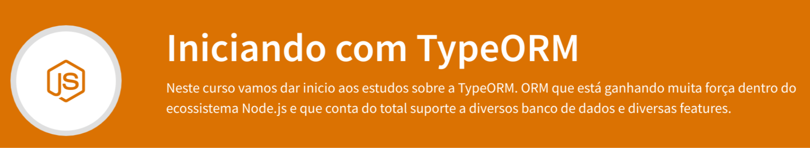

# Iniciando com o TypeORM

Este projeto foi desenvolvido baseado no curso de TypeORM da School Of Net.



## Configurações Iniciais

1. Criar o projeto
    ```
    npx typeorm init --name TypeORM-start --database mysql
    ```
## Utilização básica para manipulação dos dados no banco

1. Conectando no banco
2. Inserindo dados na tabela
3. Buscando os dados inseridos
